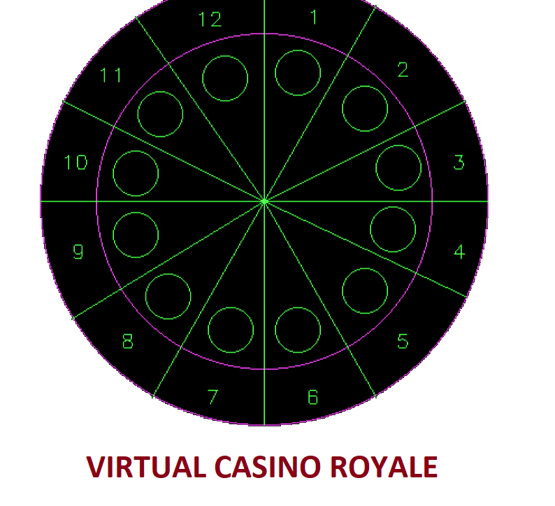

# VIRTUAL CASINO GAME
# (C Graphics Project)

</img> 

System Requirements:
--------------------- 
* Turbo C (Any version).  
* Or DosBox
* Or any other compiler capable of running C programs.

Execution Instructions:
------------------------
Just run the attached .c file using Ctrl+F9 or 'Run' from the menu in Turbo C.

Instructions to Play the Game:
------------------------------
* Once the program is running, you will get a home screen to select the mode (single/multiplayer). 
* Then you will be asked to enter your avatar name. Followed by entering your lucky number. 
* Then as soon as you press any key the roulette begins to rotate and then the game begins to test your luck. 
* If your entered lucky number matches with the number on the roulette then you win or else you lose.
